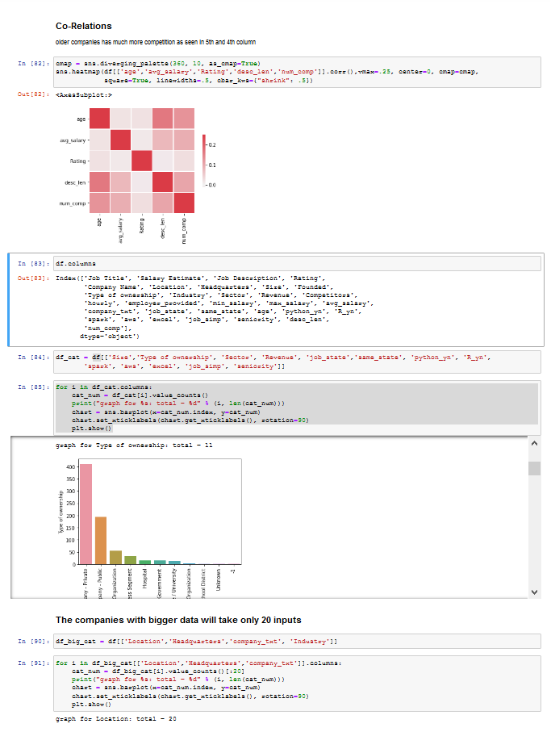
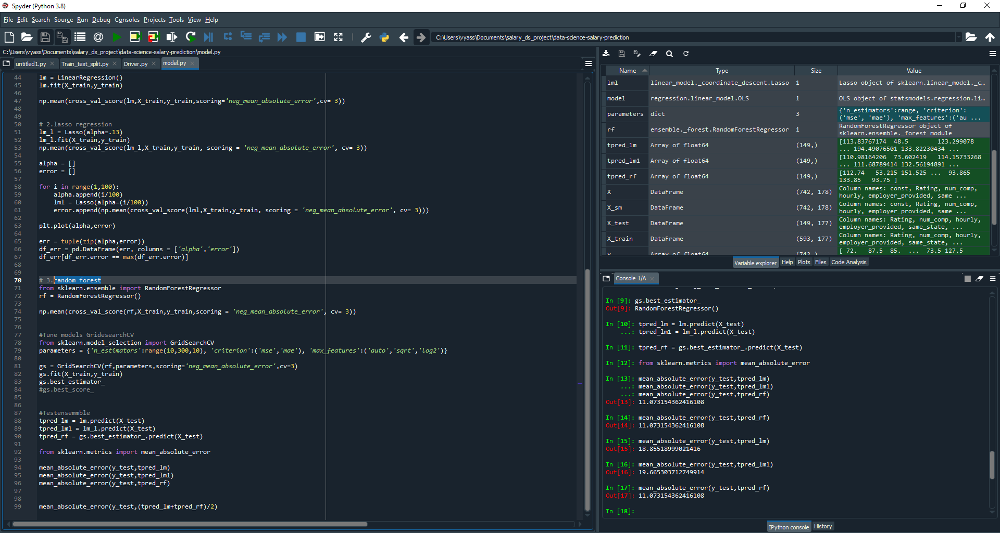

# data-science-salary-prediction: Project Overview 

* Created a tool that estimates data science salaries (Mean Absolute Error ~ $ 11K) to help data scientists negotiate their income when they get a job.
* Scraped over 1000 job descriptions from glassdoor using python and selenium
* Engineered features from the text of each job description to quantify the value companies put on python, excel, aws, and spark. 
* Optimized Linear, Lasso, and Random Forest Regressors using GridsearchCV to reach the best model. 
* Built a client facing API using Django

## Code and Resources Used 
**Python Version:** 3.7  
**Packages:** pandas, numpy, sklearn, matplotlib, seaborn, selenium, flask, json, pickle  
**For Web Framework Requirements:**  ```pip install -r requirements.txt```  
**Scraper Github:** https://github.com/arapfaik/scraping-glassdoor-selenium  
**Scraper Article:** https://towardsdatascience.com/selenium-tutorial-scraping-glassdoor-com-in-10-minutes-3d0915c6d905 

## Web Scraping
Tweaked the web scraper github repo (above) to scrape 1000 job postings from glassdoor.com. With each job, we got the following:
*	Job title
*	Salary Estimate
*	Job Description
*	Rating
*	Company 
*	Location
*	Company Headquarters 
*	Company Size
*	Company Founded Date
*	Type of Ownership 
*	Industry
*	Sector
*	Revenue
*	Competitors 

## Data Cleaning
After scraping the data, I needed to clean it up so that it was usable for our model. I made the following changes and created the following variables:

*	Parsed numeric data out of salary 
*	Made columns for employer provided salary and hourly wages 
*	Removed rows without salary 
*	Parsed rating out of company text 
*	Made a new column for company state 
*	Added a column for if the job was at the company’s headquarters 
*	Transformed founded date into age of company 
*	Made columns for if different skills were listed in the job description:
    * Python  
    * R  
    * Excel  
    * AWS  
    * Spark 
*	Column for simplified job title and Seniority 
*	Column for description length 

## EDA
I looked at the distributions of the data and the value counts for the various categorical variables. Below are a few highlights from the pivot tables. 


<span style="display:block;text-align:center"></span>

## Model Building 
First, I transformed the categorical variables into dummy variables. I also split the data into train and tests sets with a test size of 20%.   

I tried three different models and evaluated them using Mean Absolute Error. I chose MAE because it is relatively easy to interpret and outliers aren’t particularly bad in for this type of model.   

I tried three different models:
*	**Multiple Linear Regression** – Baseline for the model
*	**Lasso Regression** – Because of the sparse data from the many categorical variables, I thought a normalized regression like lasso would be effective.
*	**Random Forest** – Again, with the sparsity associated with the data, I thought that this would be a good fit. 
The data science salary prediction, cleaning, model building and eda.
  
## Model Outputs
The different models which were used in the salary prediction along with prediction mean absolute error.

<span style="display:block;text-align:center"></span>

### *_1. Linear Regression:_*
	 mean absolute error: 18.85518999021416

### *_2. Lasso Regression:_*
	 mean absolute error: 19.665303712749914	
 
### *_3. Random Forest Regressor:_*
	 mean absolute error: 11.073154362416108

## Productionization 
In this step, I built a Django API endpoint that was hosted on heroku. The model was dumped using joblib and returns an estimated salary. 

- The Website Repo: [here](https://github.com/shhubhxm/salary-priceprediction_website)
- Heroku App: [here](http://jobsalaryprediction.herokuapp.com/)


